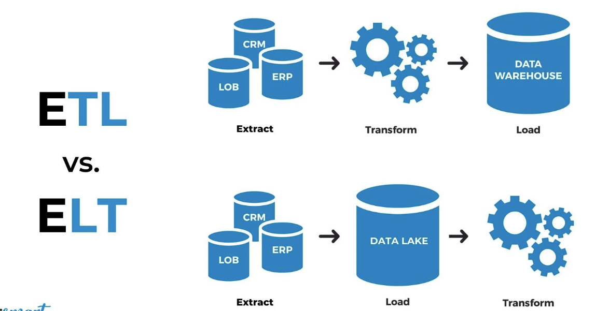
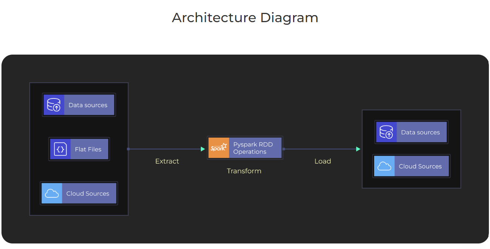

# DataEngineering-Spark-3
PySpark ETL Project for Real-Time Data Processing

## Project Description

ETL (Extract, Transform, Load) pipelines offer numerous benefits to businesses in managing their data effectively. 

ETL pipelines streamline data collection from various sources, ensuring accuracy and completeness. By transforming raw data into a consistent format, these pipelines enhance data quality, making it more reliable for analysis. This improved data quality leads to better decision-making and strategic planning within the organization. 

ETL pipelines automate repetitive tasks, reducing manual effort and saving developers time. This increased efficiency translates to cost savings and allows personnel to focus on more valuable tasks. 

ETL pipelines facilitate seamless integration between systems and applications, promoting collaboration and resonance across departments. 

Thus, by implementing ETL pipelines, businesses can unlock the full potential of their data, driving innovation and gaining a competitive edge in the market. This project will guide you on building an ETL pipeline using PySpark to help you understand how businesses efficiently extract, transform, and load large-scale data sets.

 ## ETL Vs ELT

## The Objective of the PySpark ETL Project 
This is the third project in the PySpark series. The second project aimed to provide a comprehensive exploration of the fundamental concepts and practical aspects of Apache Spark, focusing on data manipulation, querying, and performance optimization. It consisted of multiple parts, covering topics such as the comparison between Spark Datasets and Spark DataFrames, the utilization of Spark SQL for querying structured data, a recap of Spark SQL and its joins, an in-depth analysis of Spark's performance and optimization techniques, understanding query execution plans, exploring Spark User-defined Functions (UDFs), guidance on running Spark Jobs locally and in the cloud and concluding with a comparative study of the features and enhancements introduced in Spark 3.0 as compared to Spark 2.0.

This project offers a comprehensive exploration of real-time data processing with Spark Streaming, including a focus on working with DStreams and window operations. Users will gain a deep understanding of Spark Streaming and its capabilities. 

## Tech Stack for Implementing ETL pipeline using PySpark

Language: Python, SQL

Package: PySpark

Services: Apache Kafka

 

## PySpark ETL Project Overview
This project will guide you in building an ETL pipeline in PySpark using simulated data. You'll learn data creation and pipeline implementation with these key tools:

## Project Architecture

### Apache Spark
Apache Spark is an open-source, distributed computing framework for processing and analyzing large-scale datasets. It provides a unified engine that supports various data processing tasks, including batch processing, interactive queries, streaming, machine learning, and graph processing. Spark is implemented in Scala and offers APIs in Scala, Java, Python (PySpark), and R (SparkR). This project dives into Spark Structured Streaming, demonstrating its use in PySpark. You'll practically grasp incremental updates, streaming aggregation, event-time windows, and fault tolerance mechanisms like checkpointing and write-ahead logs via step-by-step guided code video walkthroughs.

### PySpark
PySpark stands as a robust open-source tool designed to process and analyze data across a network of computers. It presents a Python interface to Apache Spark, a swift and versatile system for distributed computing. Here are a few explanations for PySpark's extensive adoption: handling vast amounts of data, quick and efficient operations, staying resilient and scalable even when issues arise, seamless collaboration with the Python environment, intricate data analysis capabilities, and being a part of a supportive community and ecosystem. You'll implement streaming pipelines in PySpark, utilizing its user-friendly UI for output access.

### Apache Kafka
Apache Kafka, a distributed event streaming platform, facilitates real-time data pipeline construction. You'll delve into its components—producers, consumers, brokers, topics, and partitions—through a real-world example from Uber's Kafka ecosystem. A hands-on session with industry expert will guide you through building ETL pipelines using Kafka.

To establish a chat communication between two windows on a Windows machine using Netcat, follow the following steps:

1. Open two command prompt using run as administrator Windows

2. On the first window run: ncat -l 9999

3. On the second window run: ncat -C localhost 9999

### Dataset Used

Data Source: (https://www.nyc.gov/site/tlc/about/tlc-trip-record-data.page)

Here is the Data Analysis:

[lab_1_notebook.ipynb](https://github.com/Raghuraj-DataEngineer/DataEngineering-Spark-1/blob/main/lab_1_notebook.ipynb)

[lab_1_notebook_fixFiles.ipynb](https://github.com/Raghuraj-DataEngineer/DataEngineering-Spark-1/blob/main/lab_1_notebook_fixFiles.ipynb)

[lab_1_notebook_wTemperature.ipynb](https://github.com/Raghuraj-DataEngineer/DataEngineering-Spark-1/blob/main/lab_1_notebook_wTemperature.ipynb)

[lab_2_notebook.ipynb](https://github.com/Raghuraj-DataEngineer/DataEngineering-Spark-1/blob/main/lab_2_notebook.ipynb)

[spark-streaming-demo-1.py](https://github.com/Raghuraj-DataEngineer/DataEngineering-Spark-1/blob/main/spark-streaming-demo-1.py) 

[spark-streaming-demo-2-append.py](https://github.com/Raghuraj-DataEngineer/DataEngineering-Spark-1/blob/main/spark-streaming-demo-2-append.py) 

[spark-streaming-demo-2.py](https://github.com/Raghuraj-DataEngineer/DataEngineering-Spark-1/blob/main/spark-streaming-demo-2.py) 

[spark-streaming-demo-3.py](https://github.com/Raghuraj-DataEngineer/DataEngineering-Spark-1/blob/main/spark-streaming-demo-3.py) 

[spark-streaming-kafka-demo-1.py](https://github.com/Raghuraj-DataEngineer/DataEngineering-Spark-1/blob/main/spark-streaming-kafka-demo-1.py) 

[spark-streaming-kafka-demo-2.py](https://github.com/Raghuraj-DataEngineer/DataEngineering-Spark-1/blob/main/spark-streaming-kafka-demo-2.py) 

[spark-streaming-kafka-demo-3.py](https://github.com/Raghuraj-DataEngineer/DataEngineering-Spark-1/blob/main/spark-streaming-kafka-demo-3.py) 

[spark-streaming-kafka-demo-4.py](https://github.com/Raghuraj-DataEngineer/DataEngineering-Spark-1/blob/main/spark-streaming-kafka-demo-4.py) 

